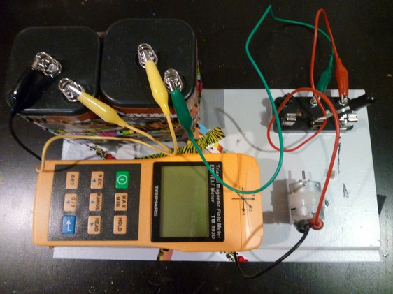

# Do EM Calculations

This project is a simple bit of data manipulation for the output of a *Tenmars*
Triaxial Magnetic Filed Meter, TM-192D ($225 from lessemf.com). The meter
creates a csv file where the values are:

time stamp, x reading, y reading, z reading, combined reading

The software assumes one needs only the x, y, and z values.

The driver for the software requires a windows machine. I installed VMWare
Fusion ($72), then Windows XP Pro. Another $40 went into wires and batteries.

Total cost: ~$350.

## Program

The program is written in python and depends on 3 modules:
Bunch, docopt, and csv.

% pvc.py -h              Douglass-MBP
usage: pyc.py [--bmG BMGFile] [--bmT BMTFile]
              [--emG EMGFile] [--emT EMTFile] [--root NAME]

Given 4 csv files, calculates the Poynting vector

optional arguments:
    --bmG BMGFile   background mGauss csv file name [default: bmG.csv]
    --bmT BMGFile   background mTesla csv file name [default: bmT.csv]
    --emG BMGFile   experimental mGauss csv file name [default: emG.csv]
    --emT BMGFile   experimental mTesla csv file name [default: emT.csv]
    -r NAME --root NAME

If the 4 files are named NAME_bmG.csv, NAME_bmT.csv,  NAME_emG.csv, NAME_emT.csv, set
this variable once.
Note: Skip the "_" in the name.

## Measuring device

A 12V DC motor is run right in front of the meter.

At home, it produced number like so:

% pvc.py -r home         Douglass-MBP
ave background E field: 0.01, 0.0, 1.693
ave background B field: 0.001, 0.0, 0.159523809524
ave experimental E field: 32.4277777778, 30.6722222222, 28.9333333333
ave experimental B field: 3.0195, 2.892, 2.654
Background Poynting Vector
0.0, 9.77619047619e-05, 0.0
Average Poynting Vector
-2.26791595767, 1.35957135185, 1.16811055556
